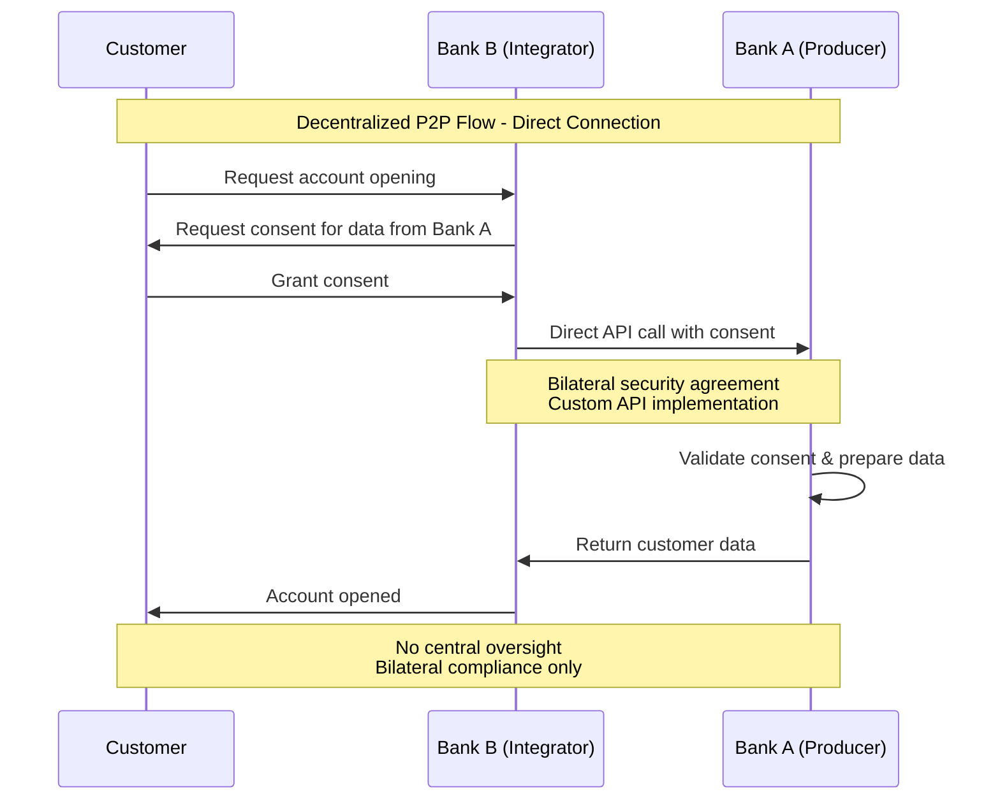
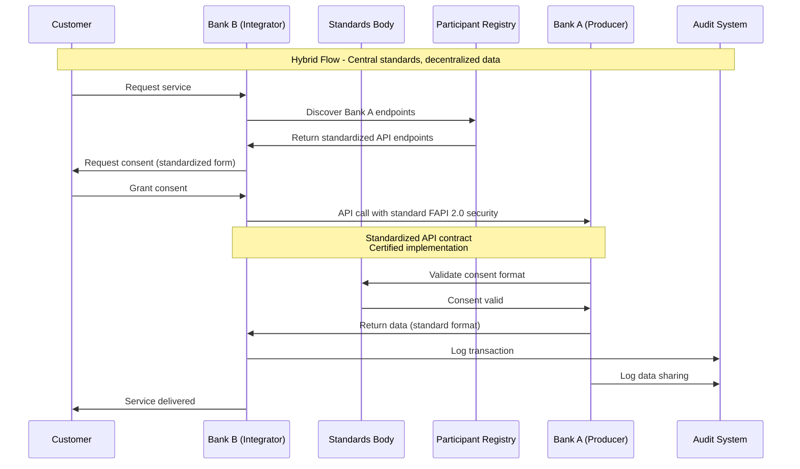

# OBP Trust Network (Federated System) Conclusion

## Content

1. [Executive Summary](#executive-summary)
2. [Conceptual Elaboration - Definition and Scope](#conceptual-elaboration---definition-and-scope)
3. [Detailed Overview of the 3 Architecture Models](#detailed-overview-of-the-3-architecture-models)
4. [Technical Roles Definition and Matrix](#technical-roles-definition-and-matrix)
5. [Governance Infrastructure](#governance-infrastructure)
6. [Existing Examples and Best Practices](#existing-examples-and-best-practices)
7. [Conclusion and Implications for Switzerland](#conclusion-and-implications-for-switzerland)

---

## Executive Summary

The Trust Network for the Open API Customer Relationship defines a federated system architecture (a distributed system with common standards) that supports various architecture models and allows for gradual evolution. The **Hybrid Model** is identified as the preferred solution for the Swiss context, as it offers the optimal balance between decentralized autonomy and central coordination.

**Key Findings:**
- Hybrid architecture combines advantages of decentralized and central organization
- Scalable evolution: Start decentralized → development to hybrid → optionally central
- Multi-stakeholder governance framework enables coordinated market development
- Technical roles matrix supports flexible participant integration

---

## Trust Network Definition

**Scope of our project:** Federated system architecture for standardized, secure data exchange between various financial service providers and related industries.

### Delimitation of Different System Approaches

| **Aspect** | **Trust Network (Federated)** | **Central Platform** | **Bilateral Solutions** |
|------------|-----------------------------------|------------------------|-------------------------|
| **Data Storage** | At original providers | Centrally collected and stored | At each provider separately |
| **Standards** | Common standards, decentralized execution | Single Provider controls standards | Fragmented standards |
| **Governance** | Multi-Provider Governance Model | Single Provider controls access and rules | Fragmented governance |
| **Connectivity** | Standardized APIs for n:n connectivity | Centrally mediated connectivity | Individual integrations between 2 partners each |
| **Risks** | Distributed risk due to decentralization | Increased dependency risks | Exponential integration effort |
| **Scaling** | Economies of scale through network effects | Central scaling with Single Point of Failure | Quadratic growth of integrations |

### Swiss Context Adjustments

**Swiss Peculiarities:**
- Strong tradition in data protection and banking secrecy
- Small-structured banking sector with many regional institutes
- High quality and security standards
- Regulatory environment with FINMA oversight

**Adjustment Requirements:**
- Swiss Banking Standards integration
- E-ID readiness and complementary use
- Multilingualism (DE/FR/IT/EN)
- Compliance with Swiss Data Protection Act (DSG)

---

## Architecture Models Overview

### Model 1: Decentralized Architecture (Peer-to-Peer)

**Conceptual Architecture Representation:**

The decentralized P2P architecture organizes itself as a fully networked system without a central coordination instance. All participants are equal and communicate directly with each other:

- **Banks** (A, B): Act as both data producer and integrator
- **FinTech** (C): Hybrid role as producer and integrator  
- **InsurTech** (D): Primarily integrator function
- **Mobility Provider** (E): Focus on data production
- **Retail Provider** (F): Primarily integrator function

**Connection Structure:** Each participant maintains direct bilateral connections to all other participants, leading to a fully meshed network with n*(n-1)/2 connections.

**Characteristics:**

| **Advantages** | **Disadvantages** |
|---------------|----------------|
| **High Autonomy**: Maximum autonomy for each participant | **Complex Integration**: Exponentially increasing integration costs (n²) |
| **Robustness**: No Single Points of Failure | **Coordination Problems**: Fragmented standards without coordination |

### Model 2: Hybrid Architecture (Preferred Solution)

**Conceptual Architecture Representation:**

The hybrid architecture combines central coordination with decentralized execution in a two-layer model:

**Central Coordination Level:**
- **Standards Body & Registry**: Develops and manages API standards as well as participant registry
- **Multi-Stakeholder Governance**: Coordinates decision-making between various interest groups
- **Certification Authority**: Provides certification services and compliance monitoring

**Decentralized Participant Level:**
The same actors as in the P2P model (Banks, FinTech, InsurTech, Mobility, Retail) operate autonomously, but according to uniform standards.

**Interaction Model:**
- Central instances deliver standards and guidelines to all participants
- Participants communicate directly with each other, but according to standardized protocols
- Fewer connections than P2P required, as standards simplify integration

**Characteristics:**

| **Advantages** | **Challenges** |
|---------------|----------------------|
| **Standards Coordination**: Central standards with decentralized execution | **Governance Complexity**: Multi-stakeholder decision-making requires coordination |
| **Scalable Architecture**: Efficient coordination with growing number of participants | **Implementation Variety**: Balance between standards and individual implementation |

### Model 3: Central Hub Architecture

**Conceptual Architecture Representation:**

The central hub architecture organizes itself as a star topology with a central node coordinating all functionalities and data flows:

**Central Hub Complex:**
- **Central Trust Hub**: Core system for all network operations
- **Centralized Data Store**: Central data storage of all participant information
- **Policy Engine**: Ruleset management and compliance enforcement
- **Audit & Compliance**: Central monitoring and reporting
- **API Gateway**: Unified access point for all external connections

**Connected Participants:**
All actors (Banks A-B, FinTech C, InsurTech D, Mobility E, Retail F) are connected exclusively via the central hub.

**Communication Model:**
- All participants communicate exclusively via the API Gateway
- No direct peer-to-peer connections between participants
- Hub processes, validates, and forwards all data requests
- Central control and monitoring of all transactions

**Characteristics:**

| **Advantages** | **Disadvantages** |
|---------------|----------------|
| **Comprehensive Control**: Maximum standardization and central control | **System Risk**: Single Point of Failure endangers entire network |
| **Uniform Compliance**: Central monitoring and audit functions | **Dependency Risk**: High dependency on central organization |

---

## Technical Roles Definition and Matrix

### Core Roles in the Trust Network

#### Data Producer (Data Owner)
**Definition:** Organization that holds original customer data and provides it via APIs

**Typical Actors:** Banks, insurance companies, fintech companies with customer base

**Main Functions:**
- Provide secure API endpoints for data query
- Consent Management and Customer Authorization
- Ensure data quality and timeliness
- Compliance with data protection and security standards

**Technical Requirements:**
- FAPI 2.0 compliant API implementation
- OAuth 2.0/OIDC integration for Authorization
- Real-time Consent Management Capabilities
- Audit Trail and Monitoring Integration

#### Data Consumer (Data User)
**Definition:** Organization that consumes customer data for its own services

**Typical Actors:** Banks, FinTechs, InsurTechs, Service Providers

**Main Functions:**
- Secure API integration for data query
- Purpose-specific data processing with customer consent
- Data protection and privacy-compliant usage
- Integration into own customer journey

**Technical Requirements:**
- FAPI 2.0 Client Implementation
- Secure token management and refresh logic
- Data minimization and purpose limitation
- Customer communication about data usage

#### Trust Anchor
**Definition:** Central instance for standards, certification, and registry services

**Typical Actors:** Industry organization, standards body, regulated entity

**Main Functions:**
- API standards development and maintenance
- Participant certification and registry
- Security standards and compliance oversight
- Dispute resolution and governance support

**Technical Requirements:**
- PKI infrastructure for certificate management
- Registry services for participant discovery
- Compliance monitoring and reporting tools
- Standards documentation and developer support

#### Technical Service Provider
**Definition:** Provider of technical infrastructure services for network participants

**Typical Actors:** Cloud providers, API Gateway providers, security specialists

**Main Functions:**
- API Gateway and management services
- Security-as-a-Service (monitoring, threat detection)
- Compliance-as-a-Service (audit, reporting)
- Integration support and developer tools

### Roles Matrix for Different Architecture Models

| Role | Decentralized | Hybrid | Central |
|-------|-----------|--------|---------|
| **Data Producer** | Direct P2P APIs | Standard APIs via Registry | APIs to Central Hub |
| **Data Consumer** | Direct P2P Integration | Standard APIs via Registry | APIs to Central Hub |
| **Trust Anchor** | Not present | Multi-Stakeholder Body | Central Platform Operator |
| **Technical Provider** | Bilateral Services | Standards-compliant Services | Hub-integrated Services |

### Data Flow Diagrams for Architecture Models 1 & 2

#### Decentralized P2P Data Flows

**Conceptual Data Flow:**

**Phase 1: Customer Request**
The customer makes an account opening request at Bank B. Bank B needs additional data from Bank A and requests corresponding customer consent.

**Phase 2: Direct API Communication**
Bank B communicates directly with Bank A via bilateral security agreements and custom API implementations. No central monitoring or standardized protocols.

**Phase 3: Data Processing**
Bank A validates the customer consent independently, prepares the data, and transmits it directly to Bank B.

**Phase 4: Service Delivery**
Bank B completes the account opening with the received data.

**Characteristic:** Fully bilateral compliance without central oversight instance.

#### Hybrid Architecture Data Flows

**Conceptual Data Flow:**

**Phase 1: Service Discovery**
The customer places a service request with Bank B. Bank B uses the central participant registry to determine the standardized API endpoints of Bank A.

**Phase 2: Standardized Consent Procedures**
Bank B presents standardized consent forms to the customer according to central specifications of the Standards Body.

**Phase 3: Certified API Communication**
Bank B communicates with Bank A via standardized FAPI 2.0 protocols. Both implementations are certified and follow uniform API contracts.

**Phase 4: Central Validation**
Bank A validates the consent formats via the central Standards Body and receives confirmation of validity.

**Phase 5: Coordinated Data Transmission**
Data transmission in standardized formats with automatic logging into central audit systems by both parties.

**Phase 6: Service Delivery**
Bank B provides the service using the standardized transmitted data.

**Characteristic:** Central standards with decentralized data sovereignty and coordinated compliance monitoring.

## Governance Infrastructure

### Central Governance Components

#### Standards Development Organization (SDO)
**Composition:** Multi-stakeholder body with representatives from:
- Banks (Major banks, Cantonal/Regional banks)
- FinTech Community Representatives
- InsurTech and other industry representatives
- Regulatory Observer (FINMA)
- Technical Experts and Academic Representatives

**Main Tasks:**
- API Standards Definition and Evolution
- Security Requirements and Best Practices
- Compliance Framework Development
- Conflict Resolution between stakeholders

#### Technical Standards Committee
**Focus:** Detailed technical specifications and implementation guidelines

**Working Groups:**
- API Design and Versioning
- Security and Authentication
- Data Models and Schema Design
- Integration Patterns and Performance

#### Compliance and Audit Board
**Focus:** Regulatory Alignment and Risk Management

**Responsibilities:**
- Compliance Framework Design
- Audit Standards and Procedures
- Risk Assessment and Mitigation
- Regulatory Liaison and Reporting

### Federated Requirements

#### Multi-Stakeholder Decision Making
**Voting Structure:** Weighted voting based on:
- Market Share: Consideration of system relevance
- Stakeholder Category: Equal representation of different categories
- Technical Contribution: Consideration of technical contributions

**Consensus Building:**
- 2/3 Majority for Standards Changes
- Simple Majority for Operational Decisions
- Unanimity for fundamental governance changes

#### Decentralized Implementation with Central Standards
**Principle:** "Specify Centrally, Implement Locally"

**Standards Centralization:**
- API Specifications (OpenAPI 3.0)
- Security Requirements (FAPI 2.0)
- Data Models (JSON Schemas)
- Compliance Frameworks

**Implementation Autonomy:**
- Technology Stack Choice
- Integration Approach
- Service Level Agreements
- Pricing Models

#### Network Effects and Incentive Alignment
**Positive Network Effects:**
- Increasing Value with growing Participant Base
- Reduced Integration Costs through Standards
- Enhanced Customer Choice and Service Quality

**Incentive Mechanisms:**
- Fee Structure based on Network Usage
- Innovation Rewards for Technical Contributions
- Market Access Benefits for Compliance Excellence

---

## Existing Examples and Best Practices

The detailed analysis of existing standards is included in the comprehensive international market analysis → [See Conclusion Market Analysis](./01-market-analysis.md). 

**Reference Implementations for Federated Systems:**
- **UK Open Banking:** Hybrid model with central standards and decentralized execution
- **European PSD2/Berlin Group:** Industry-driven federated system
- **Singapore Financial Data Exchange:** Public-Private Partnership approach

## Conceptual Elaboration - Definition and Scope

### Preferred Solution: Hybrid Model Justification

**Core Principles:**
- **Interoperability:** Standardized interfaces enable seamless integration
- **Decentralized Data Sovereignty:** Data remains with the original owners
- **Central Standards:** Common protocols and governance rules
- **Trust-based Cooperation:** Cryptographic and legal security mechanisms

**Strategic Advantages for Swiss Context:**
1. **Compatibility with Swiss Banking Tradition:** Decentralized data sovereignty respects established business models
2. **Scalability:** Standards allow efficient onboarding of new participants
3. **Innovation Promotion:** Open standards create level playing fields for FinTechs
4. **Regulatory Alignment:** Multi-stakeholder governance corresponds to FINMA preferences
5. **International Compatibility:** Hybrid models are internationally proven (see UK, EU)

### Evolution Path: Scalable Architecture Development

**Conceptual Development Path:**

The architecture evolution follows a systematic path with defined decision points:

**Phase 1: Decentralized P2P Pilot Projects**
- Starting point for quick go-live
- Bilateral agreements between few participants
- Minimal coordination requirements

**Milestone: Harmonize Standards**
- Evolution to hybrid architecture with central standards but decentralized data sovereignty

**Phase 2: Hybrid Architecture**
- Central standards development with decentralized execution
- Establish multi-stakeholder governance
- Scalable participant integration

**Goal: Mature Ecosystem with Hybrid Architecture**

---

## Conclusion and Implications for Switzerland

#### Hybrid Model as Optimal Path Forward
**Justification:**
- Balance between innovation and stability
- Respects Swiss tradition of decentralized banking structure
- Enables international interoperability
- Scalable for different industry segments

**Implementation Roadmap:** → [See ROADMAP.md](../ROADMAP.md)

**Governance-specific Phases:**
- **Phase 1:** Establish Standards Development Organisation, Governance Framework
- **Phase 2:** Finalize Core Standards, Pilot Implementation  
- **Phase 3:** Market rollout with continuous governance evolution

The hybrid trust network positions Switzerland optimally for the digital transformation of the financial sector while maintaining established values of security, quality, and customer orientation.

---

**Version:** 1.1
**Date:** November 2025
**Status:** Reviewed for Alpha Version 1.0

---

[Sources and References](./sources-and-references.md)