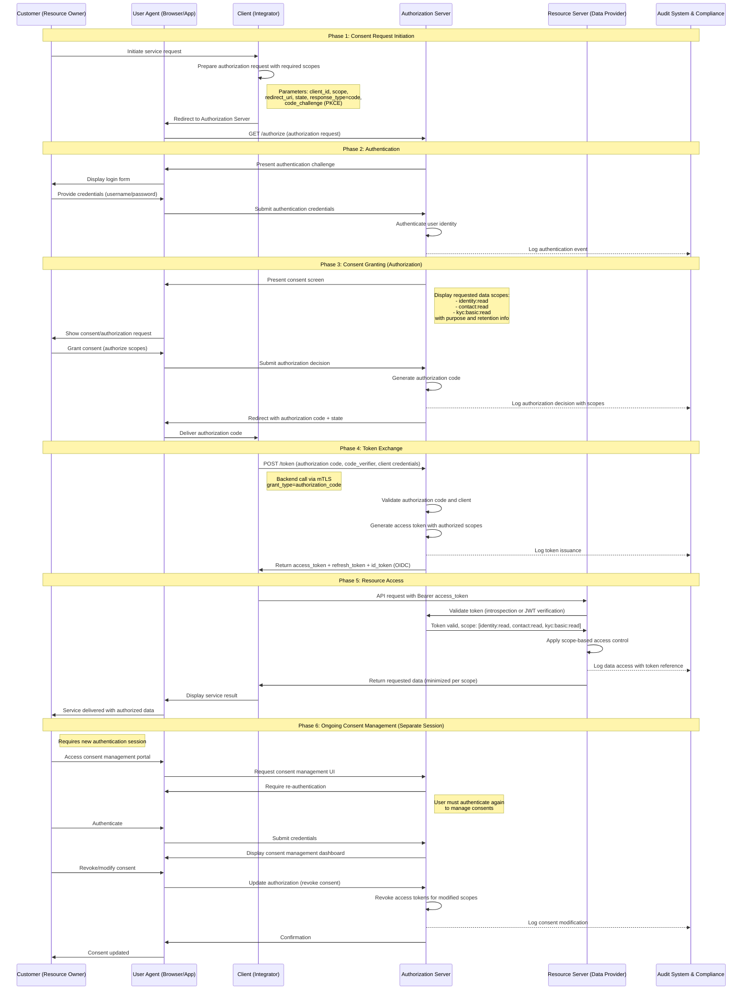
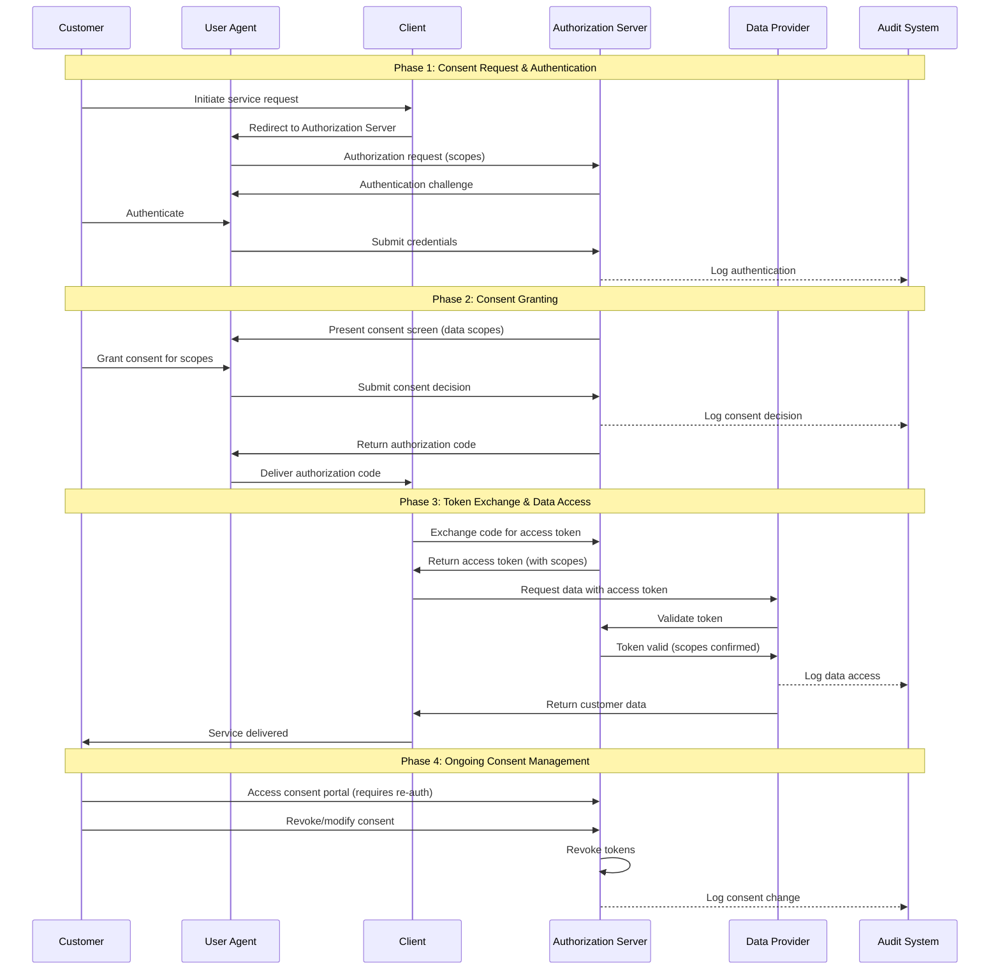
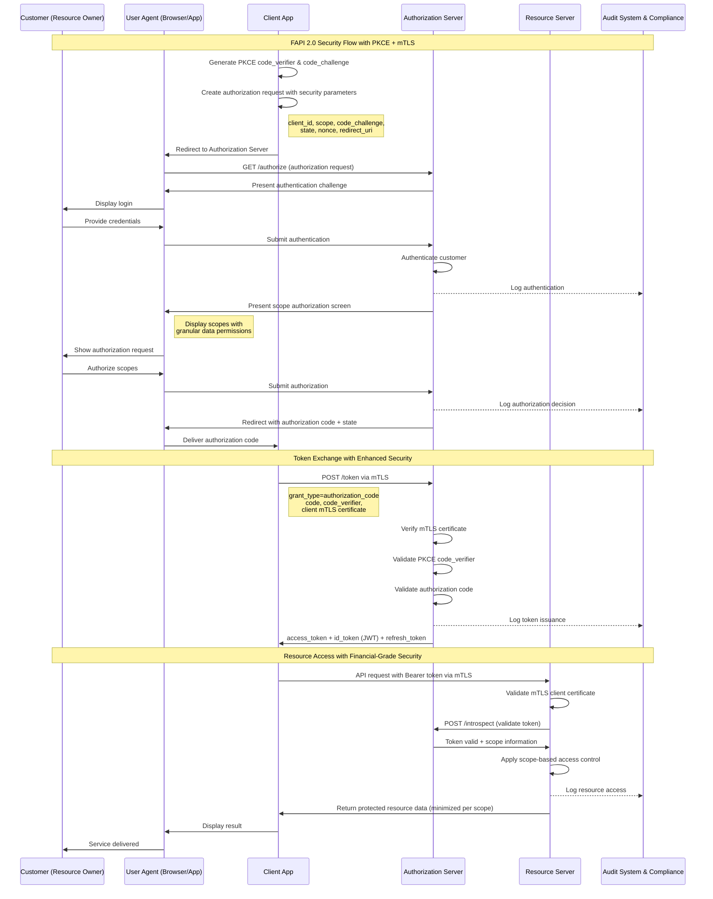
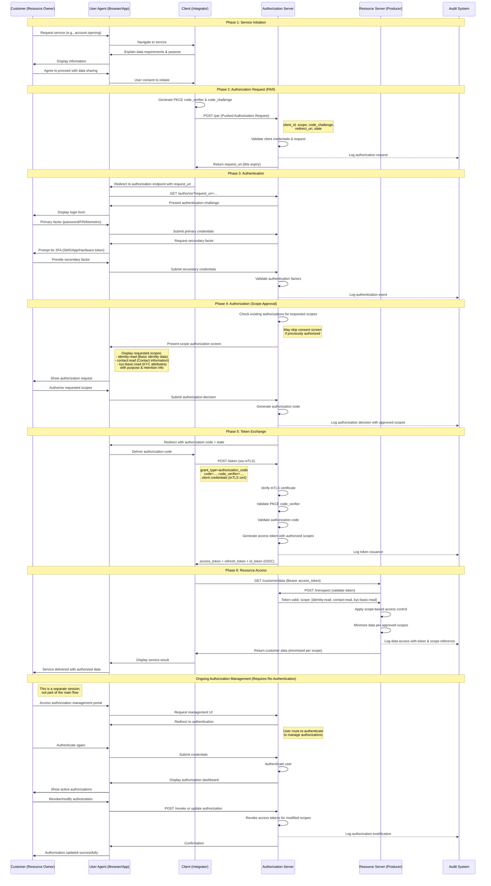
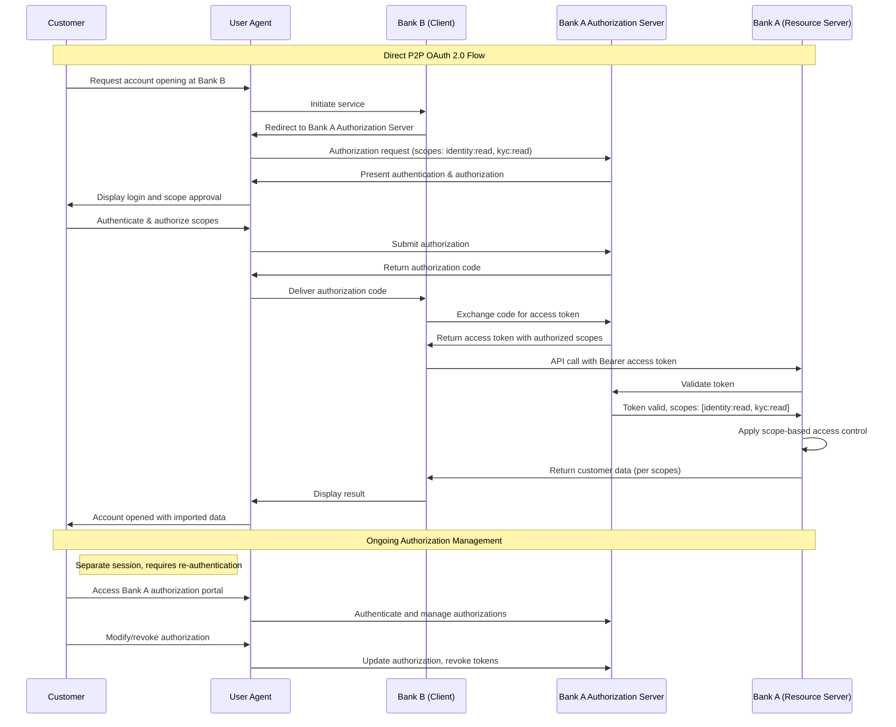
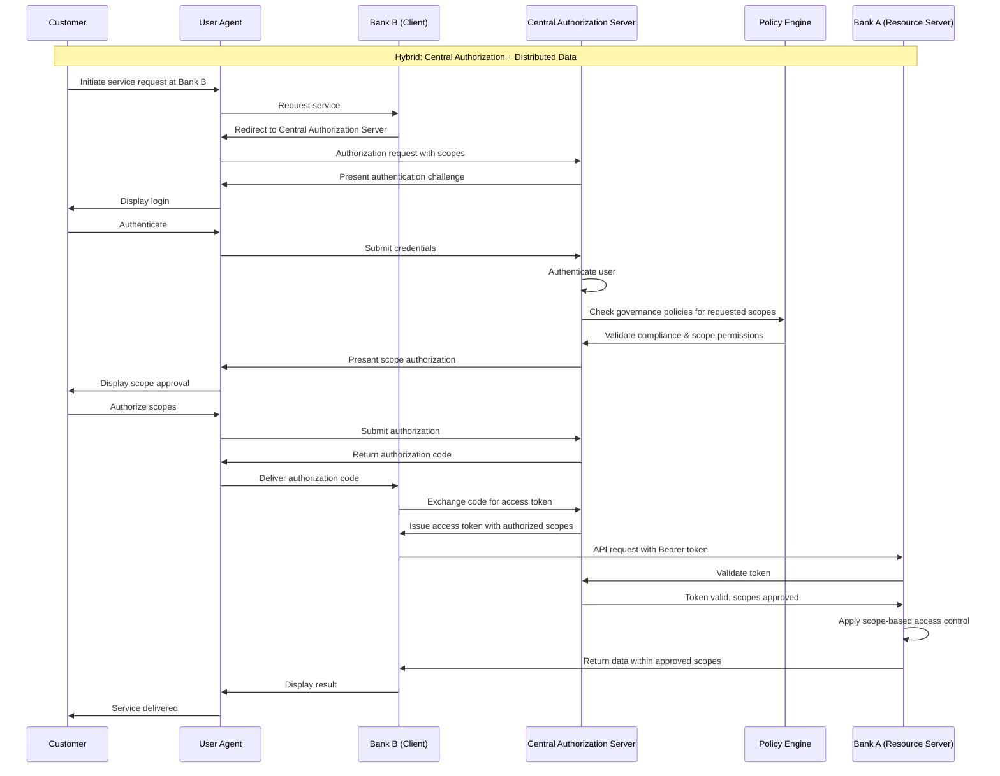

# OBP Consent and Security Flow Conclusion

## Content

1. [Executive Summary](#executive-summary)
2. [Fundamentals and Scope of the Security Framework](#fundamentals-and-scope-of-the-security-framework)
3. [Security Standards Evaluation](#security-standards-evaluation)
4. [Consent Flow Architectures](#consent-flow-architectures)
5. [JWT Token Architecture and Consent Claims](#jwt-token-architecture-and-consent-claims)
6. [Reasoned Standard Selection: FAPI 2.0, OAuth2, OIDC](#reasoned-standard-selection-fapi-20-oauth2-oidc)
7. [Consent and Security Flow Implementation](#consent-and-security-flow-implementation)
8. [Integration Patterns](#integration-patterns)
9. [Compliance and Regulatory Alignment](#compliance-and-regulatory-alignment)
10. [Conclusion and Roadmap](#conclusion-and-roadmap)

---

## Executive Summary

The Consent and Security Flow Framework establishes a FAPI 2.0-compliant security architecture for Open API Customer Relationship, which works generically and independently of the chosen trust network model. The framework is based on proven standards (FAPI 2.0, OAuth 2.0, OpenID Connect) and offers robust security mechanisms with granular consent management.

**Central Design Principles:**
- Network-agnostic security framework for all architecture models
- FAPI 2.0 compliance for Financial-grade API Security
- Granular consent management with customer control
- Sequence diagram-based implementation for business stakeholder understanding

---

## Fundamentals and Scope of the Security Framework

### Generic Security Framework

**Network Agnostic Design:** The security framework works independently of the chosen trust network architecture:
- **Decentralized:** Direct P2P security between partners
- **Hybrid:** Central standards with decentralized security implementation  
- **Centralized:** Hub-based security with central policy enforcement

**Universal Application Scope:** Uniform security for all use cases:
- Bank account onboarding with KYC-level security
- Re-identification with minimal data exposure
- Age verification with attribute-based consent
- Cross-industry services with purpose-based access control

### Relation to Trust Network Roles

**Integration with Trust Network Roles from [05 Trust Network](./05-trust-network.md):**

#### Data Producer Security Role
- **Authentication:** Customer-facing Authentication Services
- **Authorization:** Granular Data Access Control based on Consent
- **Compliance:** Audit Trail and Data Protection Enforcement

#### Data Consumer Security Role  
- **Client Authentication:** Mutual TLS and Client Credentials Management
- **Token Management:** Secure Access Token and Refresh Token Handling
- **Data Protection:** Purpose-based Data Processing with Privacy Controls

#### Trust Anchor Security Role
- **PKI Management:** Certificate Authority Services for Mutual TLS
- **Policy Enforcement:** Central Security Policies with Federation Support
- **Compliance Monitoring:** Security Audit and Incident Response

### Security Component Architecture

**Conceptual Security Architecture:**

The security components are organized in a hierarchical layer architecture:

**Customer Authentication Layer**
↓
**Authorization Server (FAPI 2.0)**
↓
**Consent Management Engine**
↓
**API Gateway & Security Enforcement**
↓
**Data Producer APIs**

**Architecture Flow:** Each layer builds on the previous one and offers specialized security functionalities. The data flow occurs top-down from customer authentication to productive APIs, with each level implementing additional security and compliance controls.

**Component Responsibilities:**
- **Customer Authentication:** Multi-Factor Authentication with Swiss E-ID integration
- **Authorization Server:** OAuth 2.0/OIDC with FAPI 2.0 extensions
- **Consent Engine:** Granular Consent with Purpose Limitation and Revocation
- **API Gateway:** Rate Limiting, Threat Detection, Audit Logging
- **Producer APIs:** Resource Server with Token Validation and Data Minimization

---

## Security Standards Evaluation

### Standards from Market Analysis Review

**Standards identified based on [01 Market Analysis](./01-market-analysis.md):**

#### FAPI (Financial-grade API) Evaluation

**FAPI 1.0 Baseline:**
- **Adoption:** UK Open Banking, Singapore SGFINEX (partial)
- **Security Level:** Medium - suitable for Low-Risk Account Information
- **Advantages:** Established, broad tool support, simpler implementation  
- **Disadvantages:** Limited security for high-value transactions

**FAPI 1.0 Advanced:**
- **Adoption:** Brazil Open Finance, Australia CDR (mandatory)
- **Security Level:** High - suitable for Payment Initiation and Sensitive Data
- **Advantages:** Proven in production, comprehensive security controls
- **Disadvantages:** Complex implementation, higher development costs

**FAPI 2.0 (Current Recommendation):**
- **Adoption:** Emerging Standard, Expert-recommended for new implementations
- **Security Level:** Very High - Next Generation Financial API Security
- **Advantages:** State-of-the-art security, simplified developer experience, future-proof
- **Disadvantages:** Newer standard, currently limited tool support

#### OAuth 2.0/2.1 and OpenID Connect Evaluation

**OAuth 2.0:**
- **Universal Adoption:** All analyzed standards use OAuth 2.0
- **Maturity:** Established standard with comprehensive ecosystem
- **Swiss Context:** FAPI 2.0 builds on OAuth 2.1 (Enhanced Security)

**OpenID Connect:**
- **Identity Layer:** Standardized Identity Claims for Customer Information
- **Integration:** Seamless integration with E-ID through OIDC Claims
- **Multi-Factor:** Native support for MFA and Step-up Authentication

### Detailed Security Standards Comparison

| Standard | Security Level | Implementation Complexity | Tool Support | Future-Proof |
|----------|----------------|---------------------------|---------------|--------------|
| **OAuth 2.0 Basic** | Medium | Low | Excellent | Limited |
| **FAPI 1.0 Baseline** | High | Medium | Good | Moderate |
| **FAPI 1.0 Advanced** | Very High | High | Moderate | Good |
| **FAPI 2.0** | Maximum | Medium-High | Limited | Excellent |

**Recommendation:** FAPI 2.0 for new implementation with fallback to FAPI 1.0 Advanced for legacy integration

---

## Consent Flow Architectures

### Terminology Alignment

The following table clarifies the mapping between OAuth 2.0/OIDC technical terms and Business/GDPR terminology:

| OAuth 2.0 / OIDC Term | Description | GDPR / Business Term |
|----------------------|-------------|---------------------|
| Authorization Server | Issues tokens after authentication and authorization | Consent Platform |
| Client | Application requesting access on behalf of the user | Service Provider / Integrator |
| Resource Owner | User granting access to their data | Data Subject / Customer |
| Resource Server | API protecting user data | Data Controller / Data Provider |
| Scope | Technical access permissions defining API access | Data Categories |
| Authorization | User grants access to requested scopes | Consent |
| Access Token | Access credential for API access | - |
| ID Token (OIDC) | Proof of authentication with user claims | - |
| User Agent | Browser or Mobile App as intermediary | - |

**Note:** In this document, "Consent" refers to user authorization according to GDPR requirements, while OAuth "Scope" defines technical access permissions. These concepts are aligned but use different terminology in their respective contexts.

### Flow Prerequisites

Before initiating the OAuth 2.0 Authorization Code Flow, the following prerequisites must be met:

**Client Registration:**
- Client application registered with Authorization Server
- Client credentials issued (client_id, client_secret, or X.509 certificate)
- Redirect URIs pre-registered and validated
- Allowed scopes configured for the client

**User Prerequisites:**
- User has an active account with the Resource Provider
- User credentials set up for authentication
- User has verified contact information for notifications

**Technical Configuration:**
- TLS/mTLS certificates configured for secure communication
- PKCE support enabled for enhanced security
- Token endpoint authentication method configured
- Scopes defined and documented according to OpenID Connect specification

**Infrastructure:**
- User Agent (Browser/Mobile App) available for redirect-based flow
- Network connectivity between all components
- Audit logging infrastructure operational

### Generic Consent Management Flow (OAuth 2.0-based)

This flow demonstrates how customer consent is managed during data exchange between providers in the Open API Customer Relationship network. The implementation follows OAuth 2.0 Authorization Code Flow standards while addressing specific requirements for customer data exchange and consent management.

**Business Context:**
- **Scenario**: Customer wants to use their existing data (held by Data Provider) with a new service (Client)
- **Consent Requirement**: Customer must explicitly authorize which data scopes are shared
- **Technical Implementation**: OAuth 2.0 Authorization Code Flow with PKCE
- **Compliance**: GDPR consent requirements mapped to OAuth 2.0 authorization scopes



### Simplified Consent Management Flow

For a high-level overview, this simplified version shows the essential steps while maintaining OAuth 2.0 compliance. See the detailed flow above for full implementation details.




### Overview of Existing Consent Flow Models

#### App-to-App Redirect Flow (UK Standard)
**Conceptual Architecture:**

The App-to-App Flow enables native mobile experience without browser redirection:

**Customer App** → **Bank App** → **Customer App (with consent)**

**Flow Characteristics:**
- **Phase 1:** Customer starts service in Integrator App
- **Phase 2:** Automatic redirection to Bank App
- **Phase 3:** Authentication and consent in native Bank App
- **Phase 4:** Return redirection to Integrator App with authorization code

**Advantages:**
- Native mobile experience with optimal UX
- No browser redirection required
- Strong Customer Authentication through Bank App

**Disadvantages:**
- Requires installed Bank Apps
- Platform-specific implementation (iOS/Android)
- Limited cross-platform compatibility

**Use Cases:** Ideal for mobile-first customer journeys with high app adoption

#### Browser Redirect Flow (PSD2 Standard)
**Conceptual Architecture:**

The Browser Redirect Flow uses standard web mechanisms for universal compatibility:

**Customer Browser** → **Authorization Server** → **Customer Browser (with code)**

**Flow Characteristics:**
- **Phase 1:** Customer starts service in browser
- **Phase 2:** Redirect to Authorization Server
- **Phase 3:** Authentication and consent in Authorization Server
- **Phase 4:** Redirect back with authorization code

**Advantages:**
- Universal browser compatibility
- No app installation required
- Simplest implementation for web services

**Disadvantages:**
- Potential UX breaks due to redirects
- Browser security limitations
- Mobile experience often suboptimal

**Use Cases:** Web-based services, legacy system integration

#### Decoupled Flow (Brazil Model)
**Conceptual Architecture:**

The Decoupled Flow enables multi-device authentication for highest security:

**Customer Device 1** → **Authorization** + **Customer Device 2** → **Consent Completion**

**Flow Characteristics:**
- **Phase 1:** Customer starts service on Device 1
- **Phase 2:** Push notification or QR code for Device 2
- **Phase 3:** Authentication and consent on Device 2
- **Phase 4:** Completion notification to Device 1

**Advantages:**
- Flexible multi-device authentication
- Enhanced security through device separation
- Support for various customer contexts

**Disadvantages:**
- Higher complexity for customers
- Additional infrastructure requirements
- Complex error handling

**Use Cases:** High-security scenarios, multi-device customer environments

### Consent Granularity Models


#### Field-Level Granular Consent
**Definition:** Customer can release specific data fields individually
```json
{
  "consent": {
    "identity.name": true,
    "identity.dateOfBirth": false,
    "contact.email": true,
    "kyc.income": false
  }
}
```

**Advantages:** Maximum customer control, Privacy-by-Design
**Disadvantages:** Complex UX, potentially overwhelming for customers

#### Category-Based Consent  
**Definition:** Consent at data category level (Identity, Contact, Financial)
```json
{
  "consent": {
    "identity": "full",
    "contact": "basic", 
    "financial": "denied"
  }
}
```

**Advantages:** Balanced UX and data protection, manageable complexity
**Disadvantages:** Less granular than field-level control

#### Purpose-Based Consent
**Definition:** Consent based on usage purpose
```json
{
  "consent": {
    "purpose": "account_opening",
    "scope": "identity+contact+kyc_basic",
    "duration": "account_lifetime"
  }
}
```

**Advantages:** Customer-understandable approach, legal compliance
**Disadvantages:** Less flexibility in data access patterns

### Recommended Hybrid Consent Approach

**Multi-Layer Consent Strategy:**
1. **Primary Layer:** Purpose-Based Consent for Customer Understanding
2. **Secondary Layer:** Category-Based Granularity for Privacy Control  
3. **Advanced Layer:** Field-Level Control for Power Users (optional)

**Advantages:**
- Considers different customer sophistication levels
- Legal compliance through purpose limitation
- Scalable for various use cases

---

## Standards Compliance and Implementation References

### OAuth 2.0 and OpenID Connect Standards

This implementation follows established industry standards for secure authorization and authentication:

**OAuth 2.0 Authorization Framework (RFC 6749)**
- **Authorization Code Grant**: Primary flow for server-side applications
- **Specification**: IETF RFC 6749 - The OAuth 2.0 Authorization Framework
- **Core Functions**: Redirect-based flow with authorization code exchange for access tokens
- **Security Extensions**: PKCE (RFC 7636) for enhanced security against authorization code interception attacks

**OpenID Connect Core 1.0**
- **Authentication Layer**: Building on OAuth 2.0, adds authentication capabilities
- **Specification**: https://openid.net/specs/openid-connect-core-1_0.html#CodeFlowAuth
- **ID Token**: JWT with authentication claims about the end user
- **Standard Scopes**: openid (required), profile, email, address, phone
- **Core Distinction**: Separates authentication (proof of identity) from authorization (access approval)

**PKCE (Proof Key for Code Exchange) - RFC 7636**
- **Purpose**: Protects authorization code flow from interception attacks
- **Mechanism**: Code Challenge/Verifier pair prevents code substitution
- **Recommendation**: Mandatory for all clients, including confidential clients

### Standards Alignment Summary

| Standard | Version | Purpose | Implementation Status |
|----------|---------|---------|----------------------|
| OAuth 2.0 | RFC 6749 | Authorization Framework | Full Compliance |
| PKCE | RFC 7636 | Code Flow Security | Mandatory |
| OpenID Connect | Core 1.0 | Authentication Layer | Full Support |
| FAPI 2.0 | Draft | Financial-grade Security | Target Implementation |
| mTLS | RFC 8705 | Client Authentication | Supported |
| JWT | RFC 7519 | Token Format | Access & ID Tokens |

### Architectural Implementation Notes

**Authorization Server Responsibilities:**
- User authentication (credentials validation)
- Authorization management (scope approval)
- Token issuance (access, refresh, ID tokens)
- Token introspection and revocation
- Authorization lifecycle management

**Note on Consent Management:**
According to bLink reference architecture, the Authorization Server can delegate consent storage to a specialized Consent Server while retaining control over the authorization flow. This is an implementation detail that does not affect the OAuth 2.0 flow structure.

**Security Best Practices:**
- Always use PKCE for Authorization Code Flow
- Implement mTLS for Confidential Client Authentication
- Use short-lived access tokens with refresh token rotation
- Validate all redirect URIs against pre-registered values
- Implement comprehensive audit logging for all authorization events
- Apply rate limiting for abuse prevention

---

## JWT Token Architecture and Consent Claims

### JWT Token Architecture & Claims

```mermaid
graph TB
    subgraph "JWT Token Structure"
        Header[Header<br/>alg: RS256<br/>typ: JWT<br/>kid: key-id]
        Payload[Payload<br/>Standard Claims<br/>Custom Claims<br/>Consent Claims]
        Signature[Signature<br/>RSA256<br/>Private Key Signed]
    end
    
    subgraph "Standard Claims"
        ISS[iss: issuer]
        SUB[sub: subject]  
        AUD[aud: audience]
        EXP[exp: expiration]
        IAT[iat: issued at]
        JTI[jti: JWT ID]
    end
    
    subgraph "Consent Claims"
        PURPOSE[purpose: account_opening]
        SCOPE[scope: basic_data kyc_data]
        CUSTOMER[customer_hash: sha256_hash]
        CONSENT_ID[consent_id: unique_id]
        CONSENT_EXP[consent_expires: timestamp]
    end
    
    subgraph "Custom Claims"
        INSTITUTION[requesting_institution: bank_id]
        USE_CASE[use_case: customer_onboarding]
        DATA_RETENTION[data_retention_period: duration]
        PROCESSING_PURPOSE[processing_purpose: specific_purpose]
    end
    
    Header --> Payload
    Payload --> Signature
    
    Payload --> ISS
    Payload --> SUB
    Payload --> AUD
    Payload --> EXP
    Payload --> IAT
    Payload --> JTI
    
    Payload --> PURPOSE
    Payload --> SCOPE
    Payload --> CUSTOMER
    Payload --> CONSENT_ID
    Payload --> CONSENT_EXP
    
    Payload --> INSTITUTION
    Payload --> USE_CASE
    Payload --> DATA_RETENTION
    Payload --> PROCESSING_PURPOSE
    
    classDef header fill:#e3f2fd
    classDef standard fill:#f3e5f5
    classDef consent fill:#e8f5e8  
    classDef custom fill:#fff3e0
    
    class Header,Signature header
    class ISS,SUB,AUD,EXP,IAT,JTI standard
    class PURPOSE,SCOPE,CUSTOMER,CONSENT_ID,CONSENT_EXP consent
    class INSTITUTION,USE_CASE,DATA_RETENTION,PROCESSING_PURPOSE custom
```



### JWT Access Token Structure

**Standard JWT Claims for Open API Customer Relationship:**
```json
{
  "iss": "https://auth.obp.ch",
  "sub": "customer_hash_sha256",
  "aud": ["https://api.bank-a.ch", "https://api.bank-b.ch"],
  "exp": 1724000000,
  "iat": 1723996400,
  "jti": "unique_token_id_12345",
  "scope": "identity:read contact:read kyc:basic",
  "client_id": "fintech_app_123"
}
```

### Custom Consent Claims Definition

**OBP-Specific Claims for Enhanced Consent Management:**
```json
{
  "consent": {
    "id": "consent_abc123",
    "purpose": "account_opening", 
    "granted_at": 1723996400,
    "expires_at": 1756532400,
    "data_categories": ["identity", "contact", "kyc_basic"],
    "granular_permissions": {
      "identity.name": "read",
      "identity.dateOfBirth": "read",
      "contact.email": "read_write",
      "kyc.income_range": "read"
    }
  },
  "data_retention": {
    "policy": "customer_lifetime",
    "deletion_request": false,
    "last_activity": 1723996400
  },
  "audit": {
    "consent_method": "explicit_opt_in",
    "consent_interface": "mobile_app_v2.1",
    "customer_ip": "192.168.1.100",  
    "legal_basis": "consent_art6_1a_gdpr"
  }
}
```

**API Data Structures Integration:** These consent claims integrate with the modular data structures → [See complete API data schemas and structures in Conclusion 04 API Endpoint Design](./04-api-endpoint-design.md#data-points--modular-data-building-blocks-version-20)

### Refresh Token and Long-Lived Consent

**Refresh Token Strategy:**
```json
{
  "refresh_token": {
    "id": "refresh_xyz789",
    "consent_id": "consent_abc123",
    "expires_at": 1756532400,
    "revocation_endpoint": "/consent/revoke",
    "customer_controls": "/consent/manage"
  }
}
```

**Long-Lived Consent Management:**
- **Initial Consent:** Defined validity period
- **Renewal Mechanism:** Automatic with customer notification
- **Revocation Rights:** 24/7 customer self-service
- **Activity Monitoring:** Automatic expiry after longer inactivity periods

---

## Reasoned Standard Selection: FAPI 2.0, OAuth2, OIDC

### Selection Based on Market Analysis

**Market Analysis Insights from [01 Market Analysis](./01-market-analysis.md):**
- 7 out of 8 standards use OAuth 2.0 as basis
- FAPI is becoming mandatory in regulated markets
- OIDC enables seamless E-ID integration

### Expert Verification and Authoritative Sources

**Security Expert Consensus:**
- **FAPI 2.0:** Recommended for new Financial API implementations
- **OAuth 2.1:** Solid foundation with enhanced security over OAuth 2.0
- **OIDC:** Essential for Identity Federation and E-ID integration

**Authoritative Specifications and References:**
- **OpenID Connect Core 1.0:** https://openid.net/specs/openid-connect-core-1_0.html#CodeFlowAuth
- **OAuth 2.0 Authorization Framework:** IETF RFC 6749
- **FAPI 2.0 Security Profile:** OpenID Foundation Specification
- **GDPR Compliance Guidelines:** EU Data Protection Regulation

**Technical Expert Input:**
- FAPI 2.0 simplifies implementation vs. FAPI 1.0 Advanced
- Community support for FAPI 2.0 increases continuously

### Swiss Context Specific Rationale

**Regulatory Alignment:**
- **FINMA Compatibility:** FAPI 2.0 exceeds FINMA security expectations
- **EU Equivalence:** Compatible with PSD2/PSD3 security requirements
- **E-ID Integration:** OIDC claims mapping for Swiss E-ID attributes

**Technical Advantages:**
- **Developer Experience:** Simplified integration vs. proprietary approaches
- **International Compatibility:** Seamless integration with EU/UK systems
- **Future-Proof:** Anticipated standard for next-generation financial APIs

**Risk Mitigation:**
- **Security-by-Design:** FAPI 2.0 includes lessons learned from FAPI 1.0
- **Compliance-Ready:** Built-in support for GDPR, PSD2, DSG requirements
- **Audit-Friendly:** Comprehensive logging and monitoring integration

---

## Consent and Security Flow Implementation

### FAPI 2.0 Security Implementation



### Authentication/Authorization Sequence

**Complete Authentication Flow for Business Stakeholders:**

#### Phase 1: Customer Initiation
```
1. Customer accesses Integrator Service
2. Integrator explains data requirements transparently  
3. Customer consents to data sharing purpose
4. System generates secure session (PKCE)
```

#### Phase 2: Authorization Request (PAR)
```
5. Integrator submits Pushed Authorization Request
   - Client credentials validation
   - Purpose and scope specification  
   - PKCE challenge transmission
6. Authorization Server validates request
7. Authorization Server returns request_uri (60 sec expiry)
```

#### Phase 3: Customer Authentication
```  
8. Customer redirected to Authorization Server
9. Strong Customer Authentication (SCA) required:
   - Primary factor: Password/PIN/Biometric
   - Secondary factor: SMS/App/Hardware Token
10. Optional: E-ID integration for enhanced verification
```

#### Phase 4: Authorization (Scope Approval)
```
11. Authorization Server checks for existing authorizations
12. Authorization Server presents scope authorization screen via User Agent:
    - Clear explanation of requested scopes and data access purpose
    - Granular scope selection (e.g., identity:read, contact:read, kyc:basic:read)
    - Duration and retention policy information
13. Customer authorizes/denies requested scopes via User Agent
14. Authorization decision recorded with audit trail
```

#### Phase 5: Token Exchange
```
15. Authorization code issued to User Agent (short expiry, single-use)
16. User Agent delivers authorization code to Client
17. Client exchanges authorization code for tokens via backend call:
    - POST /token with authorization_code, code_verifier (PKCE), client credentials
    - Backend call via mTLS for confidential clients
    - Receives: Access Token (short-lived), Refresh Token (long-lived), ID Token (OIDC)
18. Tokens contain authorized scopes (not raw "consent")
```

#### Phase 6: Resource Access
```
19. Client requests data from Resource Server API with Bearer access token
20. Resource Server validates token (introspection or JWT verification) with Authorization Server
21. Resource Server checks token scopes and applies scope-based access control
22. Resource Server returns requested data (minimized per authorized scopes)
23. Audit events logged at all systems (authentication, authorization, data access)
```

**Detailed Authentication/Authorization Sequence Diagram:**


### Security Flow from the Financial Industry Perspective

**Conceptual Customer Journey:**

The Security and Consent Flow follows a structured Customer Journey perspective:

**[Customer] starts onboarding process**
↓
**[Customer] clearly informed about data sharing**
↓
**[Customer] authenticates with strong security**
↓
**[Customer] grants granular consent for data access**
↓
**[Customer] receives immediate service benefit**
↓
**[Customer] retains full control over data sharing**

**Journey Characteristics:** The flow is designed so that the customer retains complete transparency and control in every phase, while adhering to the highest security standards (FAPI 2.0).

**Technical Implementation Perspective:**
- Detailed Sequence Diagrams for Implementation are documented in [Technical Implementation](../implementation/)
- Business Stakeholders focus on Customer Experience and Control
- Technical Teams use complete FAPI 2.0 specification for Implementation

### Security Controls Implementation

**Transport Security:**
- TLS 1.3 mandatory for all Client-Server Connections
- Certificate Pinning for Mobile Applications
- HSTS Headers for Web Applications

**API Security:**  
- Mutual TLS (mTLS) for Server-to-Server Communication
- DPoP (Demonstration of Proof-of-Possession) for Token Binding
- PAR (Pushed Authorization Request) for Request Integrity

**Data Protection:**
- Field-level Encryption for PII in Transit and at Rest
- Tokenization for Sensitive Data Storage
- Data Minimization based on Consent Scope

---

## Integration Patterns

### Trust Network Architecture Flows

#### Decentralized (P2P) Security Model




#### Hybrid Security Model



### Consent Lifecycle Management

[Consent Lifecycle Management Diagram](./resources/graphics/06-consent-security/consent-lifecycle-management.mmd)

### Cross-Industry Consent Flow

[Cross-Industry Consent Flow Diagram](./resources/graphics/06-consent-security/cross-industry-consent-flow.mmd)

**Integration Architecture:** The Hub-and-Spoke model centralizes security, consent management, and API routing in the Integrator Hub. All Data Producers are connected via standardized FAPI 2.0 APIs with mTLS, ensuring uniform security and data standards.

**Advantages:**
- Consistent Security Model across all Producers
- Simplified Integrator development (uniform pattern)
- Standardized Error Handling and Monitoring

### Federation Integration Pattern

**Cross-Domain Authentication:**
**Conceptual Authentication Flow:**
**Customer** → **Home Domain Auth** → **Cross-Domain Token** → **Resource Access**

**Federation Mechanism:** The customer authenticates once in their home domain and receives a Cross-Domain Token, which enables cross-border access to resources.

**Use Cases:**
- Swiss customers with access to EU services
- Cross-border banking relationships
- Multi-jurisdictional Use Cases

### Legacy System Integration Pattern

**API Gateway Bridge:**
**Conceptual Legacy Integration:**
**Modern FAPI 2.0 Client** → **API Gateway** → **Legacy System Adapter** → **Core Banking**

**Transformation Pattern:** The API Gateway acts as a protocol translator between modern FAPI 2.0 standards and proprietary legacy systems.

**Implementation Strategy:**
- Legacy Systems remain unchanged
- API Gateway transforms modern protocols to legacy protocols
- Gradual migration path over several years

### Mobile App Integration Pattern

**Native Mobile Integration:**
**Conceptual Mobile Integration:**
**Mobile App** → **System Browser (ASWebAuthenticationSession)** → **Auth Server** → **Mobile App**

**Native Integration:** The App uses the System Browser Framework for secure authentication without leaving the App environment.

**Security Features:**
- App-to-App Redirect where available
- System Browser for enhanced security
- Biometric authentication integration
- Certificate Pinning for API Calls

---


## Compliance and Regulatory Alignment

### FINMA Alignment

**Regulatory Requirements Mapping:**
- **FINMA-RS 2018/3 (Outsourcing):** API-based Services as Outsourcing Category
- **Data Protection:** Swiss DSG compliance through Privacy-by-Design
- **AML/KYC:** Integration with existing Compliance Processes

**Technical Controls for FINMA Compliance:**
- Comprehensive Audit Trails for all API Calls
- Data Residency Controls for Swiss Banking Data
- Incident Response Integration with FINMA Reporting

### GDPR/DSG Compliance

**Privacy by Design Implementation:**
- **Purpose Limitation:** Consent directly tied to specific Use Cases
- **Data Minimization:** API returns only consented data fields
- **Consent Management:** Granular consent with easy withdrawal
- **Right to Portability:** Standardized Data Export APIs

**Technical Implementation:**
```json
{
  "gdpr_compliance": {
    "lawful_basis": "consent_art6_1a",
    "consent_withdrawal": "https://api.obp.ch/consent/revoke/{consent_id}",
    "data_portability": "https://api.obp.ch/customer/{id}/export",
    "retention_policy": "customer_lifecycle_tied",
    "controller": "original_data_holder",
    "processor": "api_consumer_with_consent"
  }
}
```

### PSD2 Equivalence

**Strong Customer Authentication (SCA):**
- Multi-Factor Authentication mandatory for all sensitive Operations
- Dynamic Linking for Payment-related Use Cases
- Transaction Risk Analysis for adaptive Authentication

**Technical SCA Implementation:**
- Something you know: PIN/Password
- Something you have: Mobile App/Hardware Token  
- Something you are: Biometric Authentication

### Cross-Border Compliance

**International Data Transfers:**
- **EU Adequacy:** Switzerland as adequate Country for GDPR Transfers
- **UK Data Bridge:** Post-Brexit adequacy for UK Open Banking Integration
- **US Data Transfers:** Standard Contractual Clauses for US FinTech Integration

---

## Conclusion and Roadmap

### Strategic Security Architecture Benefits

**Competitive Advantages:**
- **Future-Proof Security:** FAPI 2.0 as next-generation Standard
- **International Compatibility:** Seamless Integration with global Standards
- **Customer Trust:** Transparent and granular Consent Management
- **Regulatory Compliance:** Built-in Compliance for multiple Jurisdictions

### Implementation Roadmap

The Security and Consent Implementation is an integral part of all project phases with a specific focus on FAPI 2.0 compliance and granular consent management.

**Complete Timeline:** → [See ROADMAP.md](../ROADMAP.md)

The Consent and Security Flow Framework positions the Open API Customer Relationship with state-of-the-art security standards and establishes trust among customers, partners, and regulators through transparent, secure, and compliant data processing.

---

**Version:** 1.2
**Date:** November 2025
**Status:** OAuth 2.0/OIDC Standards Compliant - Reviewed for Alpha Version 1.0

**Change Log v1.2:**
- Updated all flow diagrams to OAuth 2.0 Authorization Code Flow standards
- Added User Agent component to correctly represent browser/app mediation
- Replaced "Consent Management" with "Authorization Server" according to RFC 6749
- Implemented consistent OAuth 2.0/OIDC terminology (Scope, Authorization Code, Access Token)
- Added Standards Compliance section with references to RFC 6749, OIDC Core 1.0, PKCE, FAPI 2.0
- Added authoritative implementation references (Airlock IAM, bLink, Open Wealth)
- Changed Audit Logging to dashed arrows (supporting activity)
- Added Prerequisites section and Terminology alignment table
- Distinguished Authentication from Authorization phases
- Clarified that ongoing authorization management requires re-authentication

---

[Sources and References](./sources-and-references.md)
