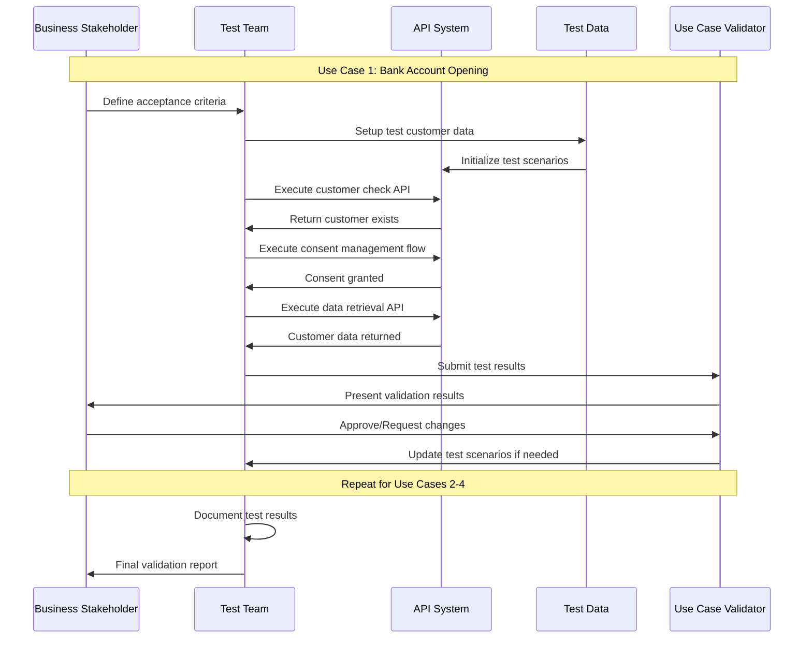
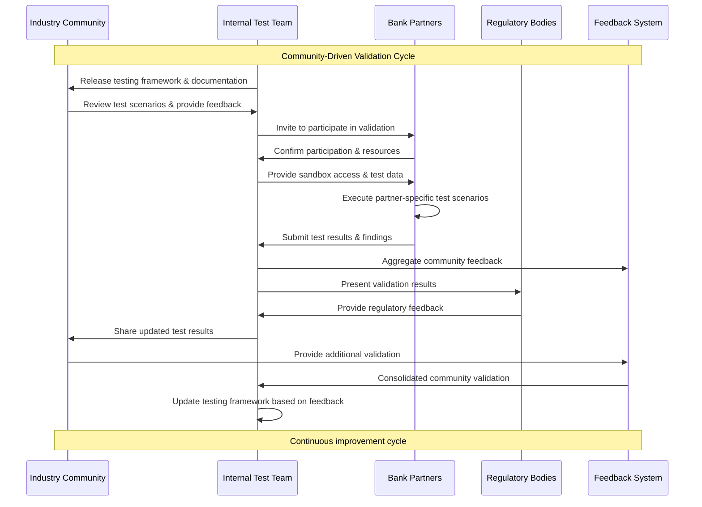

# OBP Testing and Verification Conclusion

## Content

1. [Executive Summary](#executive-summary)
2. [Approach and Goals for Testing and Verification](#approach-and-goals-for-testing-and-verification)
3. [Complete Testing Concept according to Developer Industry Standards](#complete-testing-concept-according-to-developer-industry-standards)
4. [Use Case Based Verification](#use-case-based-verification)
5. [Interactive Demos and Visualization](#interactive-demos-and-visualization)
6. [Community-Based Verification and External Validation](#community-based-verification-and-external-validation)
7. [Conclusion and Roadmap](#conclusion-and-roadmap)

---

## Executive Summary

The Testing and Verification Framework for the Open API Customer Relationship establishes comprehensive quality assurance at all levels - from technical unit tests to community-based use case validations. The framework follows industry best practices and enables continuous verification by stakeholders and partners.

**Central Approaches:**
- Multi-Layer Testing Strategy from unit tests to end-to-end integration
- Use case-based verification with the 4 prioritized use cases
- Community-driven validation by partners and industry experts
- Interactive demos for stakeholder communication and feedback gathering

**Goals:**
- Very high test coverage for all critical API functionalities
- Automated testing pipeline for Continuous Integration/Deployment
- Stakeholder-validated use case implementation
- Production-ready quality through comprehensive testing

---

## Testing and Verification Diagrams

### Multi-Layer Testing Strategy

**Conceptual Testing Framework:**

The testing framework is organized into four layers building upon each other:

**Layer 1: Unit Testing**
- API endpoint tests for individual functional modules
- Business logic tests for business rules
- Data model tests for data structures
- Security function tests for security functions

**Layer 2: Integration Testing**
- API contract testing between system components
- Database integration for data persistence
- External service integration for third-party services
- Security integration tests for end-to-end security

**Layer 3: System Testing**
- End-to-end API flows for complete business processes
- Performance testing for scalability and response times
- Security testing for penetration and vulnerability assessment
- Compliance testing for regulatory requirements

**Layer 4: Acceptance Testing**
- Use case validation with real application cases
- Stakeholder acceptance by specialist departments
- Business process validation for business workflows
- User experience testing for user friendliness

**Hierarchical Structure:** Each layer builds on the results of the previous one, ensuring systematic quality assurance from the smallest functional module to the complete business process.

### Automated Testing Pipeline

[Automated Testing Pipeline Diagram](./resources/graphics/08-testing-verification/automated-testing-pipeline.mmd)

### Use Case Verification Process

**Consent Management Testing:** The consent management flow testing includes validation of granular permissions, consent lifecycle management, and GDPR compliance. → [Complete consent flow specifications and testing requirements in Conclusion 06 Consent and Security Flow](./06-consent-security-flow.md)

### Community Validation Process

---

## Approach and Goals for Testing and Verification

### Testing Framework Concept

**Dual Testing Philosophy:**
1. **Technical Testing:** Automated testing for code quality, performance, and security
2. **Business Validation:** Use case-based verification with real stakeholders

### Overarching Goals

#### Quality Assurance
- **Functional Correctness:** All API functionalities work according to specification
- **Non-Functional Requirements:** Performance, security, scalability met
- **Regulatory Compliance:** FAPI 2.0, GDPR/FADP, FINMA requirements adhered to
- **User Experience:** Intuitive and frictionless customer journeys

#### Stakeholder Confidence
- **Developer Confidence:** Robust APIs with comprehensive documentation
- **Business Stakeholder Buy-in:** Validated business value through use case testing
- **Regulatory Acceptance:** Compliance-proven implementation
- **Market Readiness:** Production-ready system with proven stability

### Verification Methodology

#### Continuous Verification
**Iterative Validation Cycles:**
- **Sprint-based Testing:** Testing in 2-week cycles with stakeholder feedback
- **Milestone-based Validation:** Major use case testing at project milestones
- **Community Reviews:** Regular partner and expert reviews
- **Public Demos:** Quarterly public demonstrations for feedback

#### Multi-Stakeholder Approach
**Different Validation Perspectives:**
- **Technical Validation:** Developer and architect reviews
- **Business Validation:** Product Manager and Business Analyst testing
- **User Validation:** Customer Journey testing with end users
- **Regulatory Validation:** Compliance and Legal expert reviews

---

## Community-Based Verification and External Validation

### Partner-Based Validation

#### Banking Partner Program
**Structured Partner Validation:**
- **Tier 1 Partners:** Major Swiss Banks (3-5 institutions)
- **Tier 2 Partners:** Regional/Cantonal Banks (5-8 institutions)
- **Tier 3 Partners:** FinTechs and Service Providers (10+ companies)

**Validation Activities:**
- **Technical Integration Testing:** Real-world API integration
- **Business Process Validation:** Use case feasibility assessment
- **Security Review:** Independent security assessment
- **User Experience Testing:** Customer journey validation

#### Industry Expert Reviews

**Expert Panel Composition:**
- **Technical Experts:** API architecture and security specialists
- **Business Experts:** Banking and FinTech industry leaders
- **Regulatory Experts:** Compliance and legal specialists
- **Academic Experts:** Research institution representatives

**Review Methodology:**
- **Quarterly Expert Sessions:** Structured review meetings
- **Continuous Feedback Loop:** Ongoing expert input integration
- **Public Expert Endorsements:** Community credibility building
- **Best Practice Documentation:** Expert-validated implementation guides

### Community Engagement Framework

#### Open Source Contributions
**Community Development:**
- **GitHub Repository:** Open source reference implementation
- **Developer Documentation:** Comprehensive API documentation
- **Code Examples:** Realistic integration examples
- **Community Forums:** Developer support and discussion

#### Industry Standardization
**Standardization Body Engagement:**
- **Swiss FinTech Association:** Industry standard development
- **European Standards Bodies:** International alignment
- **OpenID Foundation:** Identity standard contributions
- **FIDO Alliance:** Authentication standard participation

### External Validation Processes

#### Third-Party Audits
**Independent Quality Assurance:**
- **Security Audits:** External penetration testing and security reviews
- **Compliance Audits:** Independent regulatory compliance assessment
- **Performance Audits:** Third-party performance benchmarking
- **Code Quality Reviews:** Independent code quality assessment

#### Academic Validation
**Research Collaboration:**
- **University Partnerships:** Academic research collaboration
- **Research Publications:** Peer-reviewed validation studies
- **Conference Presentations:** Industry conference validation
- **Academic Advisory Board:** Ongoing academic input

### Feedback Integration Methodology

#### Continuous Improvement Cycle
**Structured Feedback Processing:**
1. **Collection:** Multi-channel feedback gathering
2. **Analysis:** Systematic feedback categorization and prioritization
3. **Integration:** Rapid iteration based on validated feedback
4. **Communication:** Transparent communication of changes
5. **Validation:** Follow-up validation of implemented changes

#### Community-Driven Roadmap
**Collaborative Development:**
- **Public Roadmap:** Transparent development planning
- **Community Voting:** Feature prioritization through community input
- **Open Issues Tracking:** Public issue tracking and resolution
- **Regular Community Updates:** Transparent progress communication

---

## Conclusion and Roadmap

### Strategic Importance for Open API Customer Relationship

**Testing as a Trust-Building Measure:**
- Community confidence through transparent quality demonstration
- Regulatory acceptance through comprehensive compliance testing
- Market readiness through extensive partner validation
- Technical excellence through industry-leading testing standards

**Sustainable Quality Approach:**
- Continuous improvement through ongoing community feedback
- Adaptive testing framework for emerging requirements
- Scalable testing infrastructure for market growth
- Innovation-promoting through open source collaboration

The Testing and Verification Framework positions the Open API Customer Relationship as a qualitatively leading solution in the Swiss Fintech market and creates the necessary trust for broad market acceptance.

### Roadmap for Testing and Verification

Testing and verification run parallel to all implementation phases with a specific focus on community-based validation and multi-layer testing strategy.

**Complete Timeline:** → [See ROADMAP.md](../../ROADMAP.md)

---

**Version:** 1.0  
**Date:** August 2025  
**Status:** Final Draft for Review

---

[Sources and References](./sources-and-references.md)
