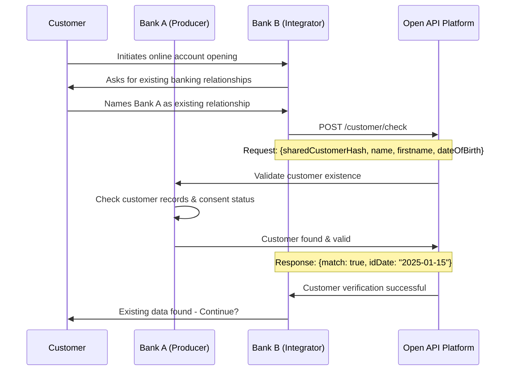
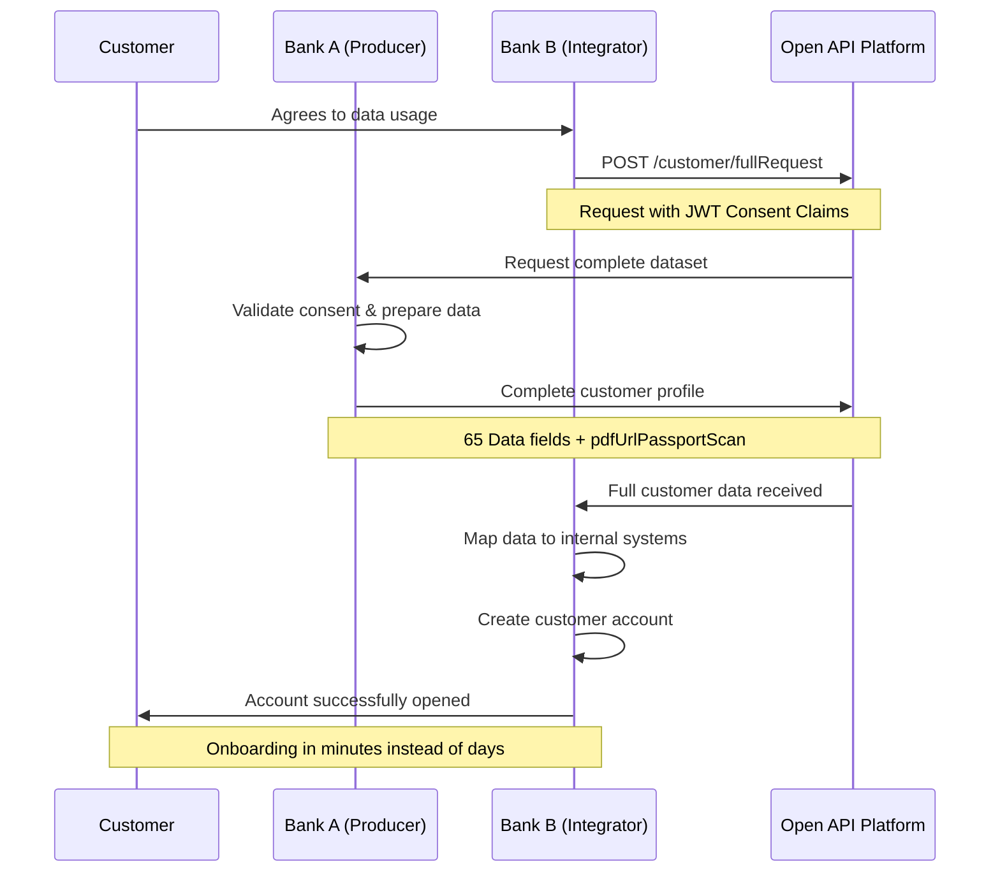

# Use Case Implementation Examples

## Overview

This document contains detailed implementation examples for the Open API Customer Relationship use cases, including technical API call sequences, integration patterns, and business process implementations.

**Note:** This document complements the [API Endpoint Design Conclusion](../business-conclusions/04-api-endpoint-design.md) by providing practical implementation guidance and detailed examples.

---

## Use Case: Bank Onboarding Implementation

### Scenario: Bank Switching with Open API Integration

**Initial Situation:** A customer wants to switch from Bank A (Producer) to Bank B (Integrator) and reuse their existing, already verified customer data.

**Actors:**
- **Customer:** Bank customer with an existing relationship with Bank A
- **Bank A (Producer):** Data providing bank with complete KYC
- **Bank B (Integrator):** New bank that wants to simplify onboarding
- **Open API:** Mediation system for secure data exchange

### Detailed Implementation

#### Phase 1: Customer Discovery & Verification



#### Phase 2: Consent Management & Data Request



### Technical Implementation Details

#### API Call Sequence for Bank Onboarding

**1. Customer Check:**
```json
POST /customer/check
{
  "sharedCustomerHash": "a1b2c3d4e5f6...",
  "lastName": "Müller", 
  "firstName": "Anna",
  "dateOfBirth": "1985-03-15"
}

Response:
{
  "match": true,
  "identificationDate": "2025-02-01",
  "verificationLevel": "QEAA",
  "lastUpdate": "2025-02-01T10:00:00Z"
}
```

**2. Full Data Request:**
```json
POST /customer/fullRequest
Header: JWT with consent claims
{
  "sharedCustomerHash": "a1b2c3d4e5f6...",
  "purpose": "accountOpening",
  "requestedDataCategories": ["identity", "address", "contact", "identification", "kyc"]
}

Response: 
{
  // Modular data building blocks according to reference process
  "identity": {
    "personalData": {
      "firstName": "Anna",
      "lastName": "Müller",
      "dateOfBirth": "1985-03-15",
      "nationality": ["CH"],
      "gender": "female",
      "maritalStatus": "single"
    },
    "verificationLevel": "QEAA",
    "verificationDate": "2025-02-01T10:00:00Z"
  },
  "address": {
    "addressType": "residential",
    "street": "Bahnhofstrasse",
    "houseNumber": "42",
    "postalCode": "8001",
    "city": "Zurich",
    "country": "CH",
    "canton": "ZH"
  },
  "contact": {
    "emailAddress": "anna.mueller@example.ch",
    "mobileNumber": "+41791234567",
    "preferredChannel": "email"
  },
  "kycData": {
    "economicBeneficiary": true,
    "taxDomicile": "CH",
    "amlRiskClass": "low",
    "pepStatus": "no",
    "fatcaStatus": "non_us_person"
  }
}
```

### Business Impact Metrics

**Efficiency Gain for Integrator Bank:**
- **Onboarding Time:** Reduction of processing time
- **Document Collection:** Reduction of manual effort
- **Compliance Checks:** Reuse of existing KYC procedures
- **Conversion Rate:** Expected increase

**Customer Benefits:**
- **Seamless Bank Switching:** No renewed document submission
- **Immediate Account Activation:** Online conclusion possible
- **Data Protection Compliant Reuse:** Granular Consent Control

---

## Additional Use Cases

### Use Case 2: Re-Identification
*TODO: Add detailed implementation for re-identification use case*

### Use Case 3: Age Verification
*TODO: Add detailed implementation for age verification use case*

### Use Case 4: EVV (Investment Advisory)
*TODO: Add detailed implementation for investment advisory use case*

---

**Version:** 1.0  
**Date:** August 2025  
**Status:** Implementation Guide

---

[Back to API Endpoint Design](../business-conclusions/04-api-endpoint-design.md)
