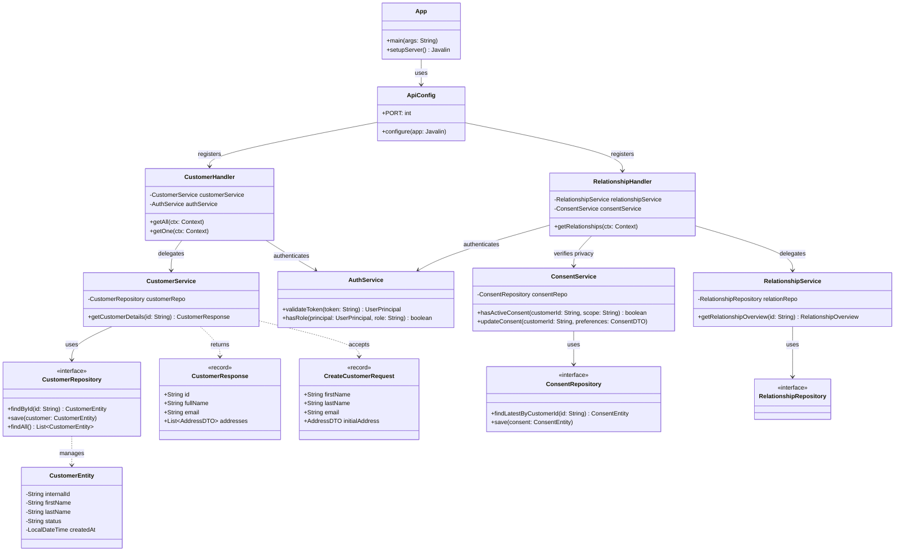

This file outlines and documents the architecture that was chosen for the Open-API. Why these decisions were made
is documented in [[designprocess]].

## Technologies
The API will be written in **Java** with the JDK version being the LTS version 25 [OpenJDK](https://jdk.java.net/25/) 

The build system is [Maven](https://maven.apache.org/)

The framework [Javalin](https://javalin.io/) is used to simplify the building of the API. 

## Architecture 

### Class diagram

